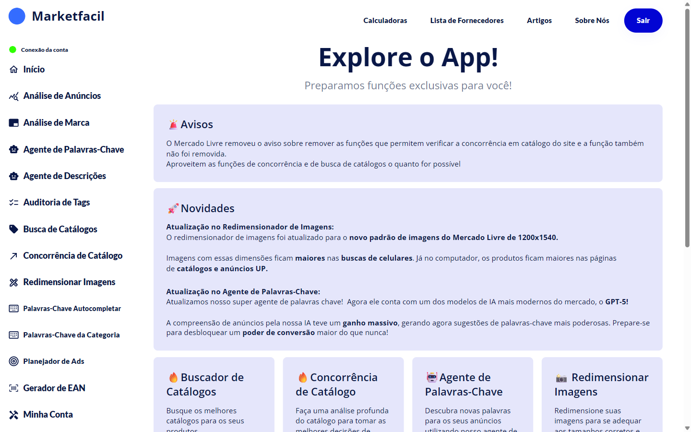

# Bem-vindo ao Marketfacil

O **Marketfacil** é a plataforma de inteligência para vendedores do Mercado Livre. Em um só lugar você analisa anúncios, verifica marcas no INPI, encontra catálogos com oportunidade, analisa concorrência, descobre palavras-chave, audita tags do Mercado Livre, redimensiona imagens, gera EANs e planeja suas campanhas de Ads.

Este manual foi feito para **você, vendedor**, sem jargão técnico. Cada página tem prints e vídeos mostrando como usar.

## Por onde começar

- 🚀 [Primeiros passos](primeiros-passos/README.md) — criar conta, conectar Mercado Livre, tour
- 🔍 [Análise de Anúncios](analise-de-anuncios/README.md) — score do seu anúncio e o que melhorar
- 🏷️ [Análise de Marca](analise-de-marca/README.md) — consulta oficial no INPI
- 📦 [Busca de Catálogos](busca-de-catalogos/README.md) — encontre catálogos com oportunidade
- 🏆 [Concorrência de Catálogo](concorrencia-catalogo/README.md) — quem compete com você
- 🔑 [Agente de Palavras-Chave](palavras-chave/README.md) — palavras que faltam + gerador de títulos IA
- ✅ [Auditoria de Tags](auditoria-tags/README.md) — escaneie toda sua conta em busca de tags negativas
- 📸 [Redimensionar Imagens](redimensionar-imagens/README.md) — padrão 1200x1540 do Mercado Livre
- 🔎 [Palavras-Chave do Autocompletar](palavras-chave-autocompletar/README.md) — o que os compradores digitam
- 📑 [Palavras-Chave da Categoria](palavras-chave-categoria/README.md) — tendências da categoria do seu produto
- 📣 [Planejador de Ads](planejador-de-ads/README.md) — saúde das suas campanhas
- 📊 [Gerador de EAN](gerador-ean/README.md) — gere EANs para criar catálogos
- 👤 [Minha Conta](minha-conta/README.md) — plano e conexões do Mercado Livre

## Playbooks — usando as features em conjunto

As features ficam muito mais poderosas combinadas. Os [Playbooks](playbooks/README.md) são workflows prontos pra situações reais:

- 🚀 [Lançando um produto novo](playbooks/lancando-produto-novo.md)
- 🔧 [Recuperando um anúncio que parou de vender](playbooks/recuperando-anuncio.md)
- 🎯 [Escolhendo um novo nicho](playbooks/escolhendo-nicho.md)
- ✍️ [Otimizando um título](playbooks/otimizando-titulo.md)
- 📈 [Preparando uma campanha de Ads](playbooks/preparando-campanha-ads.md)

## Links úteis

- **App**: [app.marketfacil.com.br](https://app.marketfacil.com.br)
- **Site**: [marketfacil.com.br](https://marketfacil.com.br)
- **Ajuda**: [checklists, troubleshooting e FAQ](ajuda/README.md)
- **Suporte**: [FAQ e contato](faq-e-suporte.md)
- **Glossário**: [termos técnicos explicados](GLOSSARIO.md)
