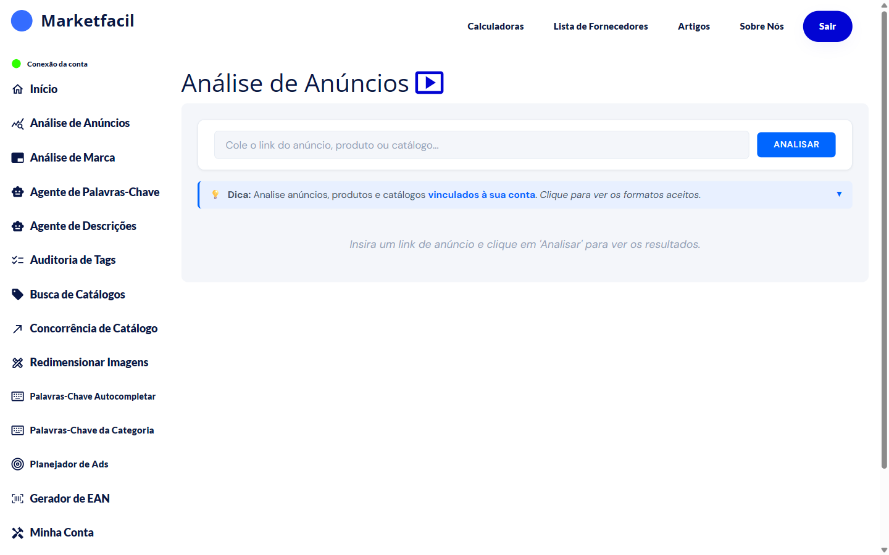

# Análise de Anúncios

A Análise de Anúncios é o ponto de partida no Marketfacil. Cole um link, aguarde alguns segundos e receba:

- Um **score** com a classificação do seu anúncio (A a F)
- O **nível ML** (porcentagem oficial do Mercado Livre)
- **O que está bom** no seu anúncio
- **O que melhorar** (ações recomendadas pelo próprio ML)
- Gráficos de **visitas** e **vendas**
- Dados de **Product Ads** (se você tiver campanha ativa)
- **Experiência de Compra** (reputação do anúncio)

## Três tipos de link aceitos

| Tipo | Exemplo de link | O que acontece |
|------|----------------|-----------------|
| **MLB** (anúncio comum) | `mercadolivre.com.br/.../MLB-4138204735-...` | Análise direta |
| **MLBU** (produto do vendedor) | `.../up/MLBU1323129818` | Lista os MLBs vinculados, você escolhe qual analisar |
| **Catálogo** | `mercadolivre.com.br/.../p/MLB12345` | Análise do catálogo |

## Nas próximas páginas

- [Como analisar um anúncio](como-analisar.md) — passo a passo com exemplos reais
- [Entendendo o score](entendendo-o-score.md) — como interpretar a classificação
- [Experiência de Compra](experiencia-de-compra.md) — o indicador de reputação
