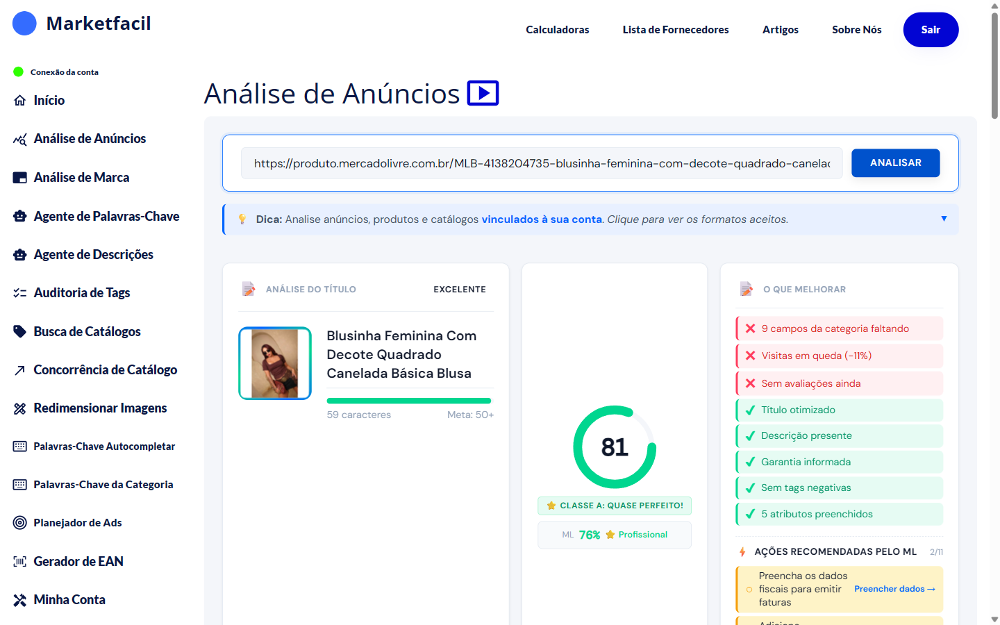
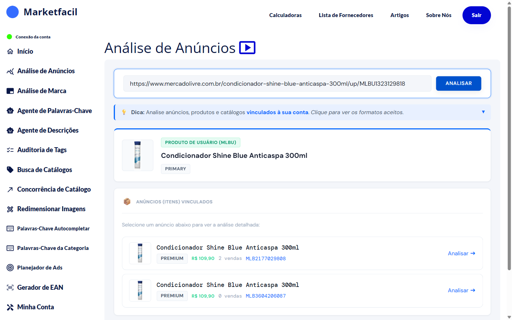
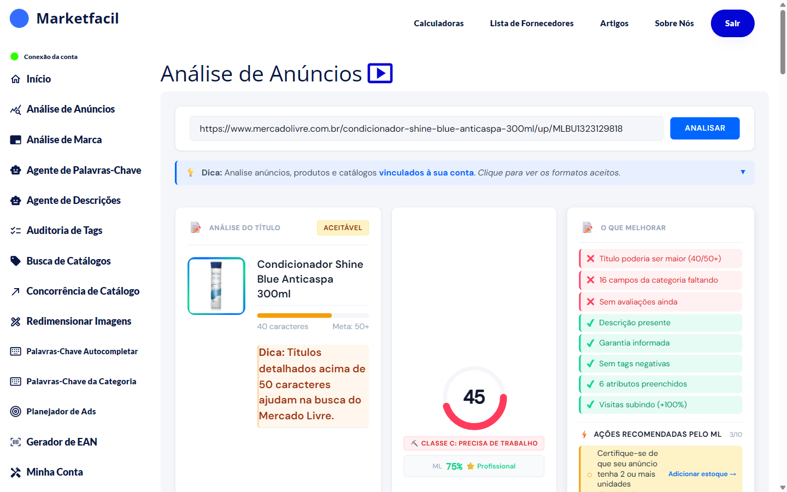

# Como analisar um anúncio

## Passo a passo

1. No menu lateral, clique em **Análise de Anúncios**.
2. Cole o link do anúncio no campo de texto.
3. Clique em **Analisar**.
4. Aguarde alguns segundos.
5. Role a página para ver o resultado completo.

## Fluxos diferentes por tipo de link

### Link de anúncio comum (MLB)

Vai direto para o resultado. Exemplo com uma blusa feminina (anúncio bem otimizado):

O que você vê nesse caso:

- **Título**: 59 caracteres (Meta: 50+) — avaliado como "Excelente"
- **Score**: 81 — Classe A: Quase perfeito
- **Nível ML**: 76% Profissional
- **O que melhorar**: 9 campos da categoria faltando, visitas em queda (-11%), sem avaliações
- **O que está bom**: título otimizado, descrição presente, garantia informada, sem tags negativas, 5 atributos preenchidos

### Link de produto do vendedor (MLBU)

O app primeiro mostra o **produto de usuário** e a lista de MLBs vinculados. Você escolhe qual analisar.

Clique em **Analisar →** na linha do MLB que você quer analisar.

### Link de catálogo

Fluxo semelhante ao MLB, mas o score leva em conta critérios específicos de catálogo (título mais longo, imagens, atributos obrigatórios).

## Exemplo de anúncio com problemas

Ao analisar o condicionador:

Diferente do exemplo anterior:

- **Score**: 45 — Classe C: Precisa de trabalho
- **Título**: 40 caracteres (abaixo da meta de 50+)
- **O que melhorar**: título curto, 16 campos da categoria faltando, sem avaliações
- **Dica mostrada**: "Títulos detalhados acima de 50 caracteres ajudam na busca do Mercado Livre"

Esse contraste entre Classe A (blusa) e Classe C (condicionador) mostra o que um anúncio bem otimizado faz diferente.

## Perguntas frequentes

**P: Analiso anúncios de concorrentes ou só os meus?**
R: A Análise de Anúncios funciona com anúncios, produtos e catálogos **vinculados à sua conta**. Para analisar concorrência de catálogo, use a feature [Concorrência de Catálogo](../concorrencia-catalogo/README.md).

**P: Por que às vezes o score muda ao analisar de novo?**
R: Os dados do Mercado Livre mudam em tempo real — novas avaliações, mudanças de título, tags. O score reflete o estado atual do seu anúncio.

**P: Quais classes existem?**
R: De A (excelente) a F (crítico). A classificação é qualitativa — quanto mais próximo de A, melhor otimizado está seu anúncio.
