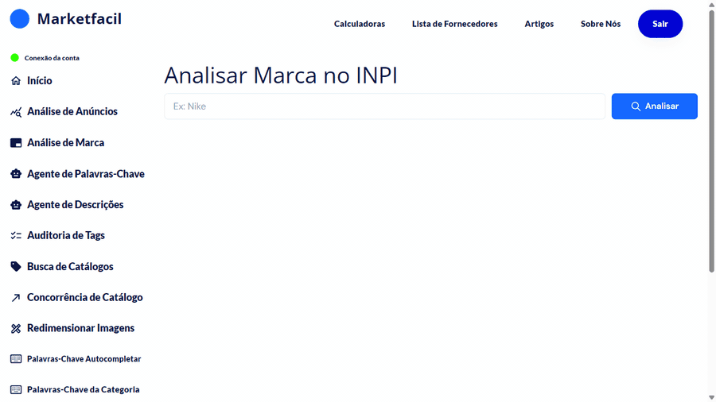
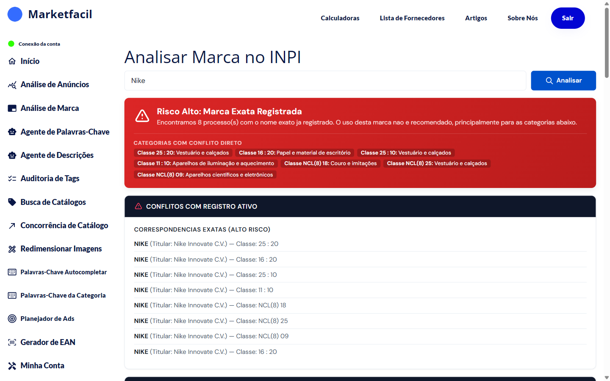

# Análise de Marca

A **Análise de Marca** consulta a base oficial do INPI (Instituto Nacional da Propriedade Industrial) e mostra se o nome de uma marca está registrado.

**Use sempre antes de:**
- Criar anúncio que mencione uma marca no título, descrição ou ficha técnica
- Entrar em um **catálogo** que tenha nome de marca
- Comprar estoque de um fornecedor que usa determinada marca

## A regra de ouro


🚫 **Se a marca tem registro no INPI, evite usar — independente da classe.**

Mesmo em classes de serviço (onde o BPP do Mercado Livre não se aplica), o titular da marca ainda pode:
- Enviar **notificação extrajudicial** exigindo a retirada do uso
- Entrar com **ação judicial** por uso indevido de marca
- Reportar ao Mercado Livre por outros canais além do BPP
- Pedir **indenização**

**Recomendamos entrar apenas em catálogos/anúncios cujo nome de marca não tem registro no INPI.**


## Como usar

1. No menu lateral, clique em **Análise de Marca**.
2. Digite o nome da marca (ex: "Nike").
3. Clique em **Analisar**.
4. Aguarde alguns segundos e veja o resultado.

## Como ler o resultado

### Exemplo: marca muito registrada

O que essa tela mostra:

- **Banner vermelho**: 8 processos encontrados com o nome exato
- **Categorias com conflito direto**: Classes 25, 16, 11, NCL(8) 18, 25, 09
- **Lista de processos ativos**: titular, classe, status

## Entendendo as classes do INPI

As classes indicam o tipo de negócio protegido pelo registro:

| Classe | Tipo | O que significa para você |
|--------|------|----------------------------|
| **1–34** | Produtos | Titular **pode** pedir retirada direta de anúncios de produtos no Mercado Livre via BPP. **Não use.** |
| **35–45** | Serviços | Titular **não pode** usar o BPP para retirar anúncios de produtos, **mas ainda pode acionar legalmente** (notificação, processo judicial). **Evite usar mesmo assim.** |


⚠️ **Mito comum**: "marca só em classe 35 é de risco baixo, posso usar".

**Errado.** A classe 35 impede só o atalho do BPP — o titular continua tendo os direitos normais de marca registrada. Pode processar você no cível, pedir indenização e obrigar a retirar o uso. O Mercado Livre também pode agir por outros canais.

**Regra simples:** se existe registro, evite.


## Cenários e decisões

### Cenário 1: marca encontrada em qualquer classe (1–45)
**Não use.** Procure outra estratégia:
- Vender o produto sem mencionar a marca no título
- Comprar de distribuidor oficial e solicitar autorização por escrito
- Mudar de produto/nicho

### Cenário 2: marca apenas "Em análise" ou "Indeferida"
**Evite mesmo assim.** Se for concedida depois, o titular pode pedir retirada retroativa dos seus anúncios e estoque.

### Cenário 3: marca não encontrada no INPI
**Risco menor**, mas verifique também:
- Google (alguém pode ter a marca de fato sem registro formal)
- Redes sociais e páginas oficiais
- Busca no INPI com variações (com acento, sem acento, espaços diferentes)

### Cenário 4: você é revendedor autorizado
Mesmo com autorização, tenha **documentação por escrito** do titular. O Mercado Livre pode pedir comprovação se houver reclamação.

## Dicas

- Faça a busca **antes** de criar qualquer anúncio com nome de marca.
- Busque **variações** (com/sem acento, espaços diferentes, plural/singular).
- Para produto genérico, remova o nome da marca do título — use **descrição genérica** ("tênis esportivo preto" em vez de "tênis Nike Air Max").
- Se quiser construir um negócio próprio, considere **registrar sua marca** no INPI — protege você e te dá direitos sobre ela.

## Perguntas frequentes

**P: O Marketfacil registra minha marca no INPI?**
R: Não. O Marketfacil **consulta** a base pública do INPI. Para registrar, entre no site oficial do INPI ou contrate um agente/advogado.

**P: A consulta é oficial?**
R: Sim — os dados vêm direto do sistema do INPI. Mesma informação que você veria no site oficial, mais rápida e organizada.

**P: Classe de serviço não libera o uso?**
R: Não. Classe 35-45 apenas **limita o atalho do BPP** — o titular da marca mantém todos os direitos legais e pode agir por outros meios (notificação, processo judicial, denúncia ao marketplace por outras vias).

**P: Posso usar uma marca "Em análise"?**
R: Tecnicamente sim, mas o risco é real: se for concedida, o titular pode pedir retirada retroativa. Evite.

**P: Sou revendedor de um produto de marca. Posso usar o nome?**
R: Em geral sim, mas **tenha autorização por escrito** do titular e cuidado com descrições que sugiram exclusividade. Na dúvida, procure orientação jurídica.
