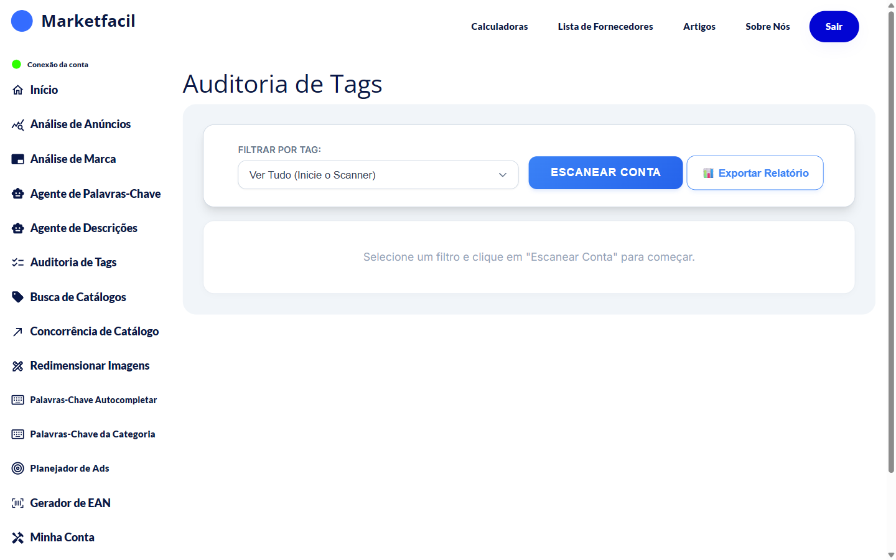

# Auditoria de Tags

A **Auditoria de Tags** escaneia **todos os anúncios da sua conta** no Mercado Livre e mostra quais estão com tags que afetam a performance. Diferente da Análise de Anúncios (que analisa um por vez), aqui você vê **o panorama completo** da conta.

## Como usar

1. No menu lateral, clique em **Auditoria de Tags**.
2. Escolha um filtro (por padrão "Ver Tudo").
3. Clique em **Escanear Conta**.
4. Aguarde o escaneamento — quanto mais anúncios, mais demora.
5. Veja o relatório por tag.
6. (Opcional) Clique em **Exportar Relatório** para baixar em Excel.

## O que são "tags"?

O Mercado Livre atribui **tags** automáticas aos seus anúncios com base em qualidade técnica, performance e conformidade. Algumas são positivas, outras são negativas.

**Exemplos de tags que prejudicam** (podem aparecer no relatório):
- `poor_quality_picture` — foto em baixa qualidade
- `deal_of_the_day` — elegível a promoção
- `good_quality_thumbnail` — thumbnail aprovado (positiva)

O relatório mostra **quais anúncios** estão com cada tag, pra você agir em lote.

## Por que isso importa

Tags negativas reduzem a exposição dos seus anúncios no Mercado Livre. Corrigir em lote (50 anúncios de uma vez, por exemplo) traz retorno rápido em visitas.

## Dicas de uso

- Rode a auditoria **uma vez por mês** se você tem muitos anúncios.
- Priorize corrigir a tag **mais comum** primeiro — tem maior impacto agregado.
- **Exporte o relatório** antes de começar a mexer. Serve como baseline.

## Perguntas frequentes

**P: A auditoria mexe nos meus anúncios?**
R: Não. Ela só **lê** o status atual.

**P: Com que frequência devo rodar?**
R: Mensal é razoável. Semanal se você tem alto volume de novos anúncios.

**P: Por que demora?**
R: O escaneamento lê cada anúncio individualmente via API do Mercado Livre, que tem limite de requisições. Contas grandes podem levar vários minutos.
