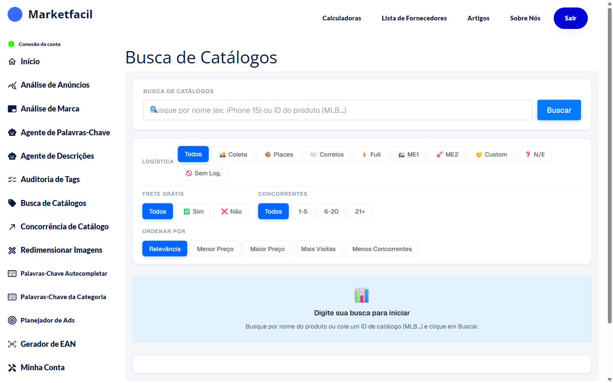
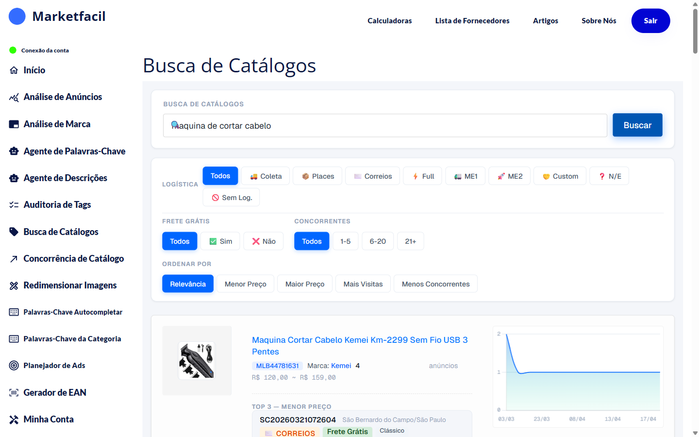

# Busca de Catálogos

A **Busca de Catálogos** ajuda você a encontrar produtos novos para vender na base de catálogos do Mercado Livre. Você busca por palavra-chave ou ID, aplica filtros avançados e recebe uma lista rankeada.

## Como usar

1. No menu lateral, clique em **Busca de Catálogos**.
2. Digite o que procura (ex: "máquina de cortar cabelo") ou cole um ID de catálogo (MLB...).
3. Ajuste os filtros (opcional).
4. Clique em **Buscar**.

## Filtros disponíveis

### Logística
- **Todos**, **Coleta**, **Places**, **Correios**, **Full**, **ME1**, **ME2**, **Custom**, **N/E**, **Sem Log.**

### Frete Grátis
- **Todos**, **Sim**, **Não**

### Concorrentes
- **Todos**, **1–5**, **6–20**, **21+**

### Ordenar por
- **Relevância** (padrão)
- **Menor Preço**
- **Maior Preço**
- **Mais Visitas**
- **Menos Concorrentes**


💡 **Dica:** combine filtros pra encontrar nichos. Exemplo: Correios + Frete Grátis "Não" + Concorrentes "1–5" mostra catálogos com pouca disputa e sem guerra de frete.


## Como ler o resultado

Para cada catálogo aparece:

- **Foto e título** do produto
- **ID do catálogo** (MLB...)
- **Marca**
- **Quantidade de anúncios** concorrentes
- **Faixa de preço** (mínimo ~ máximo)
- **Gráfico de visitas** dos últimos dias
- **TOP 3 — Menor Preço**: os três anúncios mais baratos com vendedor, cidade, tipo de envio

## Ações a partir do resultado

- Clicar no catálogo → abre no Mercado Livre
- Ir para [Concorrência de Catálogo](../concorrencia-catalogo/README.md) para análise profunda
- Ir para [Análise de Anúncios](../analise-de-anuncios/README.md) para avaliar o catálogo

## Dicas

- Busque **termos específicos** ("máquina dragão") em vez de genéricos ("máquina").
- Catálogos com **1–5 concorrentes** e boas visitas são os "verde" do ponto de vista de oportunidade.
- Anote os IDs interessantes e volte depois — o cenário muda em semanas.

## Perguntas frequentes

**P: Por que a busca demora?**
R: Para cada catálogo o Marketfacil também consulta concorrentes, visitas e outros dados. Buscas amplas podem levar mais tempo.

**P: Posso buscar por código MLB direto?**
R: Sim. Cole o ID no campo de busca e clique em Buscar.

**P: O resultado inclui catálogos sem vendedores ativos?**
R: Não. Mostra apenas catálogos com anúncios publicados.
