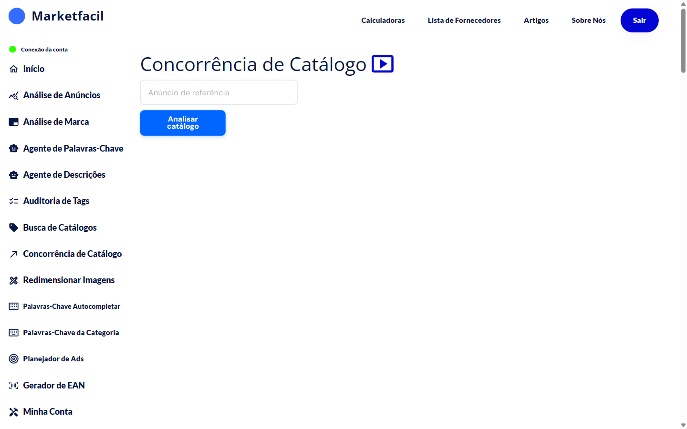
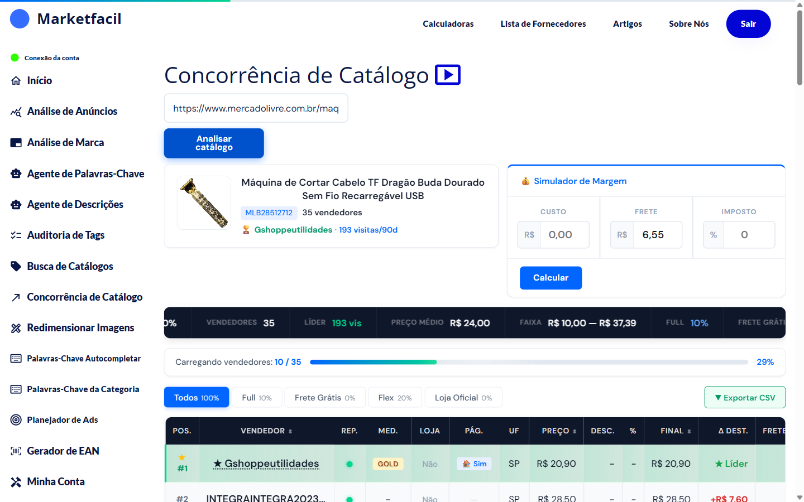

# Concorrência de Catálogo

Cole o link de qualquer catálogo do Mercado Livre (mesmo que não seja seu) e veja uma análise completa dos vendedores que disputam a Buy Box, com preços, frete, reputação, cidade e **simulador de margem** pra avaliar se vale entrar.


💡 Essa é uma das poucas features do Marketfacil que permite analisar **anúncios de terceiros** em profundidade.


## Como usar

1. No menu lateral, clique em **Concorrência de Catálogo**.
2. Cole o link do catálogo (formato `.../p/MLBxxx`).
3. Clique em **Analisar catálogo**.
4. Aguarde o carregamento — o app busca dados de **cada competidor** em paralelo (pode levar de 1 a 3 minutos).

## Resultado — visão geral

### Header do catálogo
- Foto, título, ID
- **Quantidade de vendedores** ativos
- **Líder** atual (mais visitas nos últimos 90 dias)

### Simulador de Margem
Entre com **Custo**, **Frete** e **Imposto (%)** → clique em **Calcular** pra ver sua margem em cada faixa de preço do catálogo. Decisão de entrada em catálogo ficou muito mais fácil.

### Barra de métricas (navy)
- **Vendedores** (35)
- **Líder** (visitas do líder)
- **Preço médio**
- **Faixa de preço** (mín–máx)
- **Full %** (quantos vendem via Mercado Envios Full)
- **Frete grátis %**
- **Flex %**

### Abas de filtro
- **Todos** — todos os vendedores
- **Full** — só os que usam Full
- **Frete Grátis** — só frete grátis
- **Flex** — vendedores com Flex
- **Loja Oficial** — apenas lojas oficiais

### Tabela de competidores
Colunas principais:

| Coluna | O que significa |
|--------|-----------------|
| **POS** | Posição no catálogo (líder = #1) |
| **Vendedor** | Nome e link do perfil |
| **REP** | Reputação (semáforo do ML) |
| **MED** | Medalha ML (Gold, Silver, Bronze) |
| **LOJA** | Se é loja oficial |
| **PÁG** | Se tem página própria |
| **UF** | Estado do vendedor |
| **PREÇO** | Preço atual |
| **DESC. / %** | Desconto aplicado |
| **FINAL** | Preço final que o comprador vê |
| **Δ DEST.** | Diferença em relação ao preço do destaque |
| **FRETE** | Tipo de frete |


✅ Você pode **exportar a tabela em CSV** para abrir no Excel e trabalhar os dados.


## Como usar na prática

### Decidir se entrar em um catálogo
1. Rode a análise.
2. Digite seu **custo** no Simulador de Margem.
3. Compare seu preço-alvo com a **Faixa** e o **Preço médio**.
4. Se sua margem ainda for saudável no menor preço do catálogo → vale entrar. Caso contrário → procure outro catálogo.

### Identificar o líder e sua estratégia
- O líder geralmente tem combinação: preço competitivo + Full + reputação alta.
- Olhe a coluna **Δ DEST.** — se todo mundo está muito acima do líder, ele está "roubando" visitas com preço.

### Buscar oportunidade escondida
- Catálogos com líder fraco (reputação baixa, sem Full) = oportunidade de você assumir com melhor atendimento.

## Perguntas frequentes

**P: Por que alguns dados de concorrente aparecem vazios?**
R: O Mercado Livre bloqueia parte das informações de terceiros. O Marketfacil mostra o que é público (nome, preço, frete, reputação, cidade).

**P: O que é "Δ DEST."?**
R: Delta em relação ao destaque (Buy Box). Se seu anúncio está R$ 5,00 acima do líder, isso aparece como `+R$ 5,00` em vermelho.

**P: Posso analisar catálogo de competidor direto?**
R: Pode — qualquer catálogo público do Mercado Livre funciona.

**P: Quanto tempo demora?**
R: De 1 a 3 minutos dependendo do número de vendedores. Não feche a aba.
