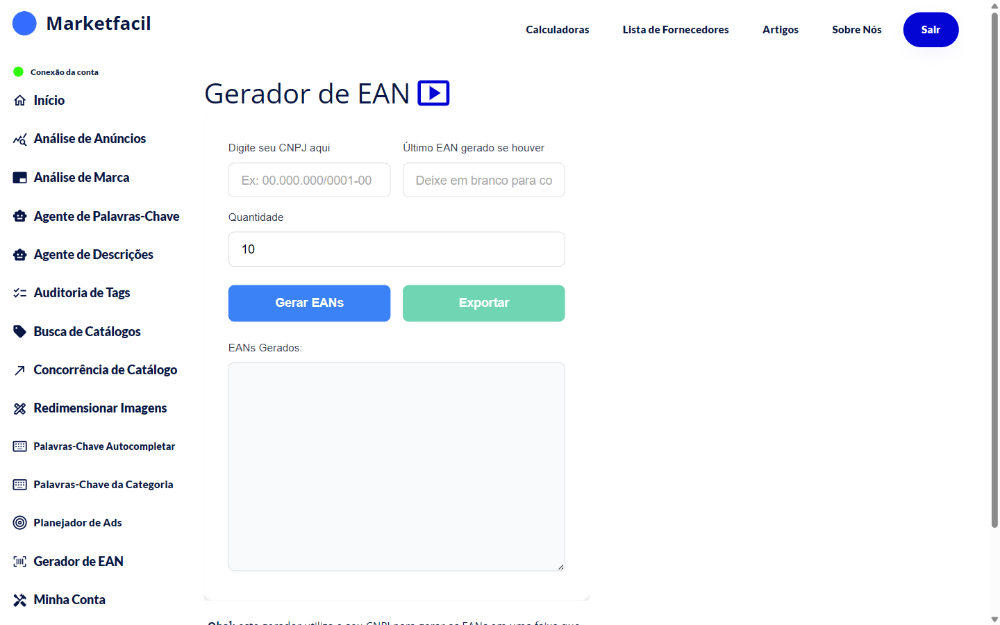

# Gerador de EAN

O **Gerador de EAN** cria códigos EAN para você usar nos seus anúncios e **criar catálogos novos** no Mercado Livre quando o produto ainda não tem um.


⚠️ **Atenção**: os EANs gerados **não são homologados pela GS1 Brasil**. Não use em embalagens físicas que vão para varejo tradicional. Eles funcionam dentro dos marketplaces para permitir a criação de catálogo.


## Como usar

1. No menu lateral, clique em **Gerador de EAN**.
2. Digite seu **CNPJ** no campo correspondente.
3. (Opcional) Se já gerou EANs antes, informe o **último EAN gerado** para continuar a sequência.
4. Escolha a **quantidade** (padrão: 10).
5. Clique em **Gerar EANs**.
6. Copie os EANs gerados ou clique em **Exportar** para baixar em arquivo.

## Para que serve

- Criar **catálogo novo** no Mercado Livre quando seu produto ainda não tem um
- Usar em marketplaces que exigem EAN mas não exigem homologação GS1

## Atenção (limitações)

- **Não são oficiais**: se você precisa vender em grandes varejistas físicos, contrate EANs da GS1 Brasil.
- **Use sempre o mesmo CNPJ**: EANs gerados para um CNPJ estão vinculados. Se trocar de CNPJ, comece uma nova sequência.
- **Guarde a lista** dos EANs usados — evita duplicar.

## Perguntas frequentes

**P: Posso usar esse EAN em qualquer marketplace?**
R: Na prática funciona em Mercado Livre, Shopee, Magalu, Amazon (sempre checar as regras do marketplace). Para varejo físico ou exportação, precisa GS1.

**P: Quantos EANs posso gerar?**
R: Não há limite prático. Gere apenas o que for usar.

**P: E se o CNPJ do meu fornecedor já tem EAN homologado?**
R: Use o EAN oficial do fornecedor. O gerador serve quando o produto ainda não tem EAN.
