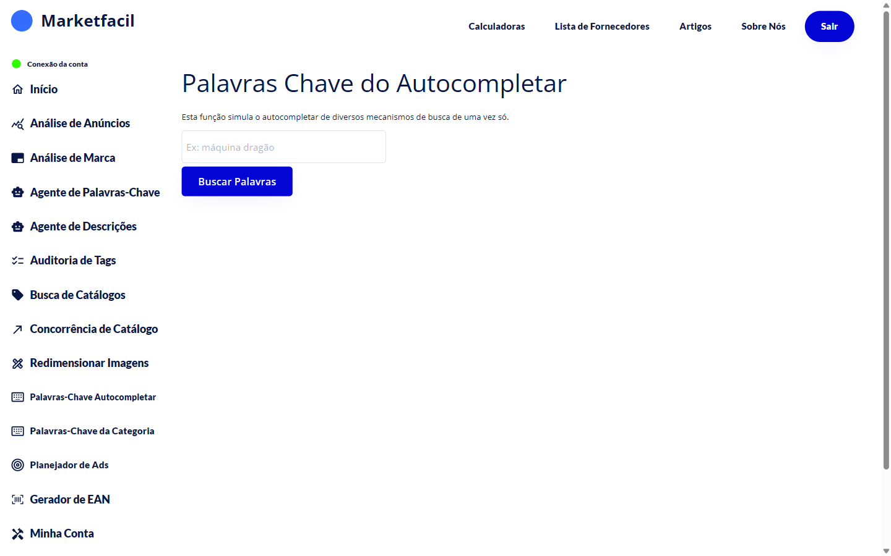

# Palavras-Chave do Autocompletar

Essa feature mostra o que os compradores estão **efetivamente digitando** nos mecanismos de busca (Mercado Livre e outros) quando começam a escrever o termo do seu produto. Serve pra descobrir termos de alta intenção de compra.

## Como usar

1. No menu lateral, clique em **Palavras-Chave Autocompletar**.
2. Digite um termo raiz (ex: "máquina dragão").
3. Clique em **Buscar Palavras**.
4. Veja a lista de sugestões reais dos buscadores.

## Para que serve

- Descobrir **variações reais** do nome do seu produto ("máquina dragão" vs "máquina de cortar cabelo dragão")
- Identificar **termos de cauda longa** com baixa concorrência
- Encontrar **erros de grafia** comuns que seus compradores cometem
- Ideias de conteúdo para descrição e anúncios pagos

## Dicas de uso

- Teste **termos raiz curtos** pra maximizar sugestões ("máquina" retorna mais do que "máquina profissional de cortar cabelo").
- Combine com o [Agente de Palavras-Chave](../palavras-chave/README.md) pra comparar os termos encontrados aqui com o que seu anúncio já tem.
- Use as sugestões não só no título — também na descrição e em campanhas de Ads.

## Perguntas frequentes

**P: De onde vêm as sugestões?**
R: Dos próprios buscadores. São as sugestões que aparecem no autocompletar quando o usuário começa a digitar.

**P: Serve só pro Mercado Livre?**
R: Também. A função agrega sugestões de diversos mecanismos de busca em uma só lista.
