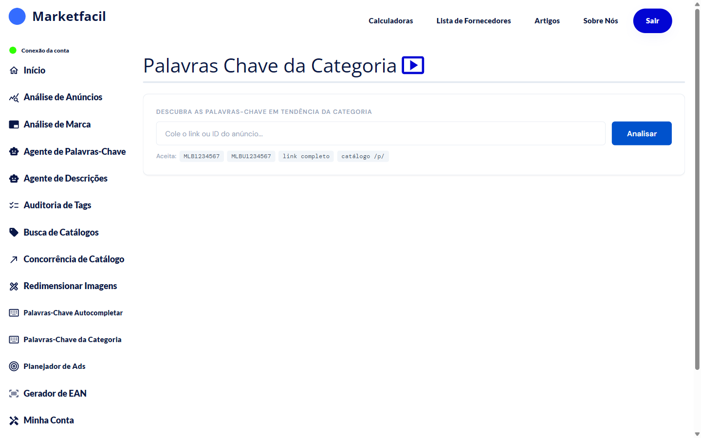

# Palavras-Chave da Categoria

Essa feature mostra as **palavras-chave em tendência dentro da categoria** de um anúncio específico. Útil pra entender o que está bombando no seu nicho e o que incluir pra surfar a onda.

## Como usar

1. No menu lateral, clique em **Palavras-Chave da Categoria**.
2. Cole o link ou ID do anúncio que define a categoria de referência.
3. Clique em **Analisar**.

## Formatos aceitos

- **MLB1234567** — anúncio comum
- **MLBU1234567** — produto de usuário
- **Link completo** — URL do anúncio
- **Catálogo /p/** — link de catálogo

## Para que serve

- Descobrir **termos em alta** na categoria (nem sempre são os termos óbvios)
- Entender **sazonalidade** — palavras que ficam em alta perto de datas comemorativas
- Ajustar **título e descrição** pra capturar buscas recentes

## Diferença pras outras features de palavras-chave

| Feature | O que mostra |
|---------|--------------|
| [Agente de Palavras-Chave](../palavras-chave/README.md) | Palavras que **faltam** no seu título comparado com concorrentes |
| [Autocompletar](../palavras-chave-autocompletar/README.md) | O que os **compradores digitam** nos buscadores |
| **Categoria** (esta) | O que está em **tendência** na categoria do anúncio |

Use as três em conjunto pra uma otimização completa de título.

## Perguntas frequentes

**P: "Tendência" considera quanto tempo?**
R: O app foca em janelas recentes (últimos dias/semanas) pra capturar o que está em alta agora.

**P: Posso analisar anúncio de concorrente?**
R: Sim — a análise funciona com qualquer MLB público.
