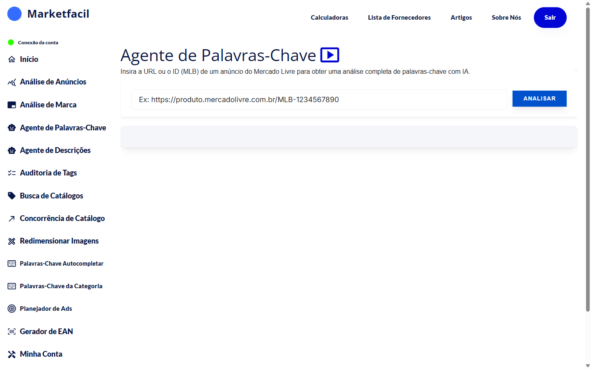

# Agente de Palavras-Chave

O **Agente de Palavras-Chave** é o especialista em otimização de título do Marketfacil. Cole o link do seu anúncio e o agente:

- Lista **todas as palavras-chave** que o Mercado Livre associa ao seu anúncio
- Mostra quais **palavras faltam** no seu título (comparando com concorrentes)
- Gera **sugestões de títulos** usando IA
- Explica em quais contextos cada palavra faz sentido

## Como usar

1. No menu lateral, clique em **Agente de Palavras-Chave**.
2. Cole o link ou ID do anúncio (aceita MLB, MLBU ou link de catálogo).
3. Clique em **Analisar**.
4. Aguarde — o agente faz scraping, processa com IA e gera o resultado.

## O que você vê no resultado

### 1. Header do produto
Foto, título atual, preço e badges do ML.

### 2. Palavras indexadas
Tags coloridas mostrando o que o ML já associa ao seu anúncio (palavras do título + palavras dos atributos).

### 3. Barra de estatísticas
- **Palavras Faltando**: quantidade total
- **Combos IA**: sugestões geradas
- **Categorias**: agrupamentos de palavras
- **Copiar Palavras**: botão pra copiar tudo de uma vez

### 4. Palavras que Faltam
Lista rankeada de palavras individuais que concorrentes usam e você não. Cada palavra tem:
- Score de relevância
- Categorias em que aparece
- Exemplos de frases usando ela

### 5. Gerador de Títulos IA
Sugestões editáveis com contagem de caracteres, respeitando o limite (60 em anúncios, 200 em catálogo).

## Quando aplicar as sugestões


🚫 **Não mude o título de anúncios que já têm vendas recentes.**

O Mercado Livre recompensa **volume de vendas atuais** — se o anúncio vende, fica em cima; se parar de vender, cai. Mexer no título derruba a exposição, corta as visitas, corta as vendas e o ML deixa de recompensar. É um ciclo negativo que começa com essa única mudança.

Use o Agente principalmente para:
- Criar título de anúncio **novo**
- Reescrever anúncio **sem vendas recentes** (após descartar outras causas)
- Planejar títulos antes de publicar

**Anúncio que vende = título fechado.** Trabalhe fotos, descrição e atributos.


## Dicas de uso

- Priorize as palavras com **maior score** — são as que mais aparecem em sugestões.
- Os títulos da IA são uma base — **edite** pra soar natural e refletir o que o produto é de verdade.
- Depois de publicar um novo título, **não mexa mais** — deixe o ML indexar e dê tempo para o histórico se formar.

## Perguntas frequentes

**P: A IA inventa palavras?**
R: Não. As sugestões são baseadas em **palavras reais** do ecossistema do Mercado Livre (anúncios concorrentes, atributos da categoria, buscas dos compradores).

**P: Por que algumas análises demoram mais?**
R: O scraping depende do servidor do Mercado Livre. Em horário de pico, pode demorar até 30 segundos.

**P: Posso usar o título sugerido direto?**
R: Pode. Mas edite antes pra garantir que reflete seu produto e soa natural.

**P: Meu anúncio vende há meses, mas o score está em C. Devo mexer no título?**
R: **Não.** Score técnico é sobre otimização — vendas são sobre conversão. Visitas importam, mas **vendas importam mais** — é o volume de vendas que o ML recompensa. Se o anúncio vende, o título está funcionando. Trabalhe fotos, descrição e atributos.

## Veja também

- [Palavras-Chave do Autocompletar](../palavras-chave-autocompletar/README.md) — o que os compradores estão digitando
- [Palavras-Chave da Categoria](../palavras-chave-categoria/README.md) — tendências da categoria do produto
