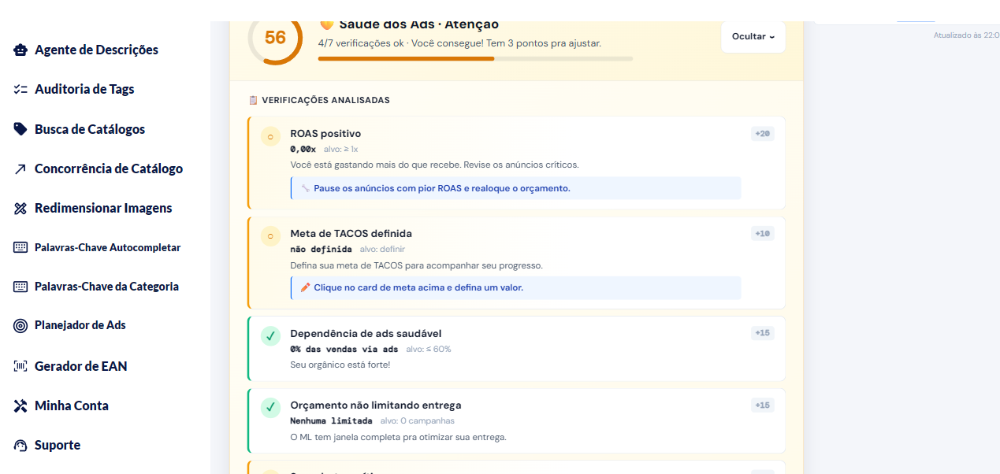

# Planejador de Ads


⚠️ O Planejador de Ads está em fase **Beta**. Dados atuais podem não refletir a versão final.


O **Planejador de Ads** é um painel de acompanhamento das suas campanhas de Mercado Ads focado em **saúde** e **hábito**:

- **Score de Saúde dos Ads** (0 a 100) com 7 verificações automáticas
- **Sistema de nível** (Bronze, Prata, Ouro…) baseado em XP
- **Sequência** de dias acompanhando
- **Tarefas diárias** para manter as campanhas otimizadas
- **Meta de TACOS** personalizada

## Primeira vez — onboarding

Ao abrir o Planejador pela primeira vez, o app pede **3 informações** para personalizar as análises:

1. **Margem média dos seus produtos (%)** — quanto você lucra por venda, em média
2. **Meta de TACOS (%)** — seu TACOS máximo aceitável
3. **Foco da sua estratégia**:
   - **Rentabilidade (ROAS alto)** — prioriza margem e retorno
   - **Visibilidade (mais tráfego)** — prioriza volume de visitas

Essas respostas ajustam como o app avalia a saúde dos seus ads. Você pode editar depois a qualquer momento.

## Períodos disponíveis

| Período | Quando usar |
|---------|-------------|
| **7D** | Reagir a mudanças recentes |
| **15D** | Tendência de curto prazo |
| **30D** | Padrão — visão mensal |
| **60D / 90D** | Planejamento estratégico |

## Saúde dos Ads — as 7 verificações

O score de saúde é a soma de pontos das 7 verificações. Clique em **Ver detalhes** ao lado do card de saúde para ver quais passaram e quais estão pendentes.

As 7 verificações observadas no app:

| Verificação | Pontos | Alvo |
|-------------|--------|------|
| **ROAS positivo** | +20 | ROAS ≥ 1x |
| **Meta de TACOS definida** | +10 | Meta preenchida |
| **Dependência de ads saudável** | +15 | ≤ 60% das vendas via ads |
| **Orçamento não limitando entrega** | +15 | 0 campanhas com orçamento limitado |
| **Sem alertas críticos** | +10 | 0 alertas críticos abertos |
| **Sem anúncios queimando dinheiro** | +10 | 0 anúncios com ROAS muito baixo |
| **Campanhas batendo meta de ROAS** | +10 | 100% das campanhas dentro da meta |

Cada verificação no app mostra:
- Seu valor atual (ex: "0,00x das vendas via ads")
- O alvo a bater (ex: "alvo: ≥ 1x")
- Uma **ação recomendada** quando a verificação falha (ex: "Pause os anúncios com pior ROAS e realoque o orçamento")

## Seções do painel

### Saúde dos Ads
Score com label qualitativo (Bom, Atenção, Ótimo…) e contagem de verificações que passaram (ex: "4/7 verificações ok"). Ao clicar em **Ver detalhes**, você vê a lista completa acima.

### Seu Acompanhamento
- **Nível** — Bronze, Prata, Ouro… com barra de XP
- **Sequência** — quantos dias seguidos você cuida dos ads
- **Histórico de Saúde** — score médio dos últimos dias

### Meta de TACOS
Você define uma meta e o app compara com seu TACOS atual. Se bater, aparece ✅ Meta atingida. A meta ideal varia por negócio — ajuste conforme sua margem e estratégia.

### Métricas diárias
Gráfico **ACOS / TACOS / ROAS Diário** e tabela **Custo vs Faturamento** com colunas: Título, Preço, ROAS, ACOS, TACOS, Custo, Faturamento, CTR, Conv., Status.

### Tarefas de Hoje
Lista de ações priorizadas pelo sistema baseadas no estado atual das suas campanhas.

## Dicas de uso

- **Mantenha a sequência** — cuidar dos ads todos os dias tem retorno maior do que mexer de vez em quando.
- **Foque nas tarefas do dia** — elas são priorizadas pelo próprio sistema.
- **Ajuste a meta de TACOS** ao seu negócio — não existe número universal (ver [Entendendo TACOS, ACOS e ROAS](entendendo-tacos.md)).

## Perguntas frequentes

**P: Como o score de saúde é calculado?**
R: É a soma de pontos das 7 verificações listadas acima. Cada verificação tem um peso fixo. Para ver quais estão ok e quais falharam, clique em **Ver detalhes**.

**P: Ganho algo ao subir de nível?**
R: É gamificação pra criar hábito — não é recompensa financeira. Mas vendedores que sobem de nível geralmente têm campanhas mais saudáveis.

**P: Posso editar meus dados de onboarding depois?**
R: Sim. Clique no card de Meta de TACOS para ajustar, ou abra novamente o onboarding.

## Veja também

- [Entendendo TACOS, ACOS e ROAS](entendendo-tacos.md) — as métricas essenciais
- [Preparando uma campanha de Ads](../playbooks/preparando-campanha-ads.md) — checklist antes de investir
