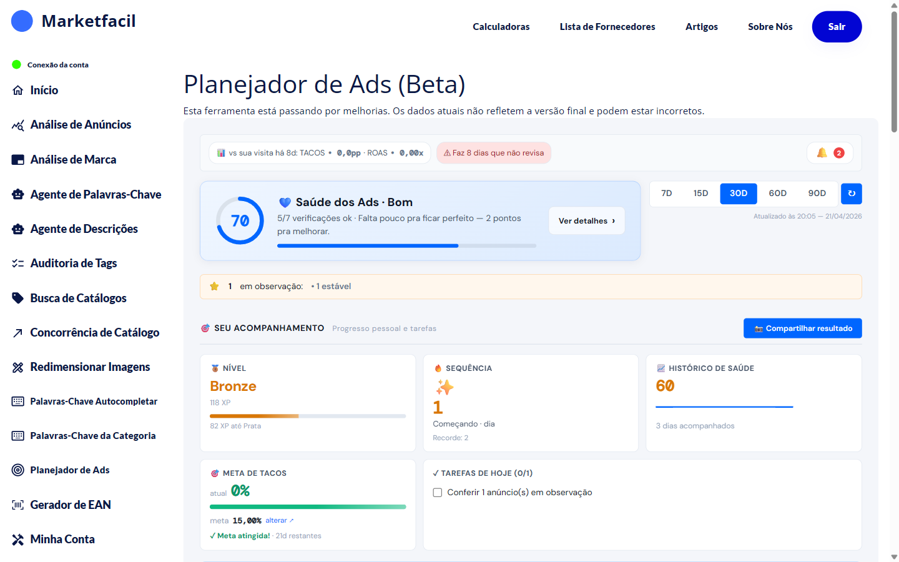

# Planejador de Ads


⚠️ O Planejador de Ads está em fase **Beta**. Dados atuais podem não refletir a versão final.


O **Planejador de Ads** é um painel de acompanhamento das suas campanhas de Mercado Ads. Diferente de um dashboard tradicional, ele foca em **saúde** e **hábito**:

- **Score de Saúde dos Ads** (0 a 100) com verificações
- **Sistema de nível** (Bronze, Prata, Ouro…) baseado em XP
- **Sequência** de dias acompanhando
- **Tarefas diárias** para manter as campanhas otimizadas
- **Meta de TACOS** personalizada

## Como usar

1. No menu lateral, clique em **Planejador de Ads**.
2. Escolha o período (**7D**, **15D**, **30D** padrão, **60D**, **90D**).
3. Veja seu score de saúde atual.
4. Cumpra as tarefas do dia na seção **Tarefas de Hoje**.
5. Acompanhe a evolução pelo **Histórico de Saúde** e pela **Sequência**.

## Seções principais

### Saúde dos Ads
Score de 0 a 100 com label qualitativo (Bom, Ótimo, Precisa Ajuste, etc). Mostra quantas verificações passaram (ex: 5/7). Ao lado, botão **Ver detalhes** lista o que foi aprovado e o que está pendente.

### Seu Acompanhamento
- **Nível** — Bronze, Prata, Ouro… com barra de XP para o próximo nível
- **Sequência** — quantos dias seguidos você está cuidando dos ads
- **Histórico de Saúde** — score médio dos últimos dias

### Meta de TACOS
Você define uma meta de TACOS personalizada e o app compara com seu TACOS atual. Se bater a meta, aparece ✅ Meta atingida. A meta ideal varia por negócio — ajuste conforme sua margem e estratégia.

### Tarefas de Hoje
Lista de ações concretas pra fazer hoje (ex: "Conferir 1 anúncio em observação"). Ao completar, o progresso conta pra sua sequência.

## Períodos disponíveis

| Período | Quando usar |
|---------|-------------|
| **7D** | Reagir a mudanças recentes (semana) |
| **15D** | Ver tendência de curto prazo |
| **30D** | Padrão — visão mensal |
| **60D / 90D** | Planejamento estratégico |

## Dicas de uso

- **Mantenha a sequência** — cuidar dos ads todos os dias tem retorno maior do que mexer de vez em quando.
- **Foque nas tarefas do dia** — elas são priorizadas pelo próprio sistema com base no estado das suas campanhas.
- **Ajuste a meta de TACOS** ao seu negócio — não existe número universal. Cada nicho, margem e estratégia pede um TACOS diferente (ver [Entendendo TACOS, ACOS e ROAS](entendendo-tacos.md)).

## Perguntas frequentes

**P: Como a saúde é calculada?**
R: O Planejador faz várias verificações (ex: campanhas sem métricas frescas, anúncios em observação, meta de TACOS atingida) e dá um score agregado. Os detalhes aparecem em **Ver detalhes**.

**P: Ganho algo ao subir de nível?**
R: É gamificação pra criar hábito — não é recompensa financeira. Mas vendedores que sobem de nível geralmente têm campanhas mais saudáveis.

**P: Posso zerar a sequência se pular um dia?**
R: A sequência é mantida enquanto você cumpre pelo menos uma tarefa por dia. Se pular, ela reseta.

## Veja também

- [Entendendo TACOS, ACOS e ROAS](entendendo-tacos.md) — as métricas essenciais de Ads
