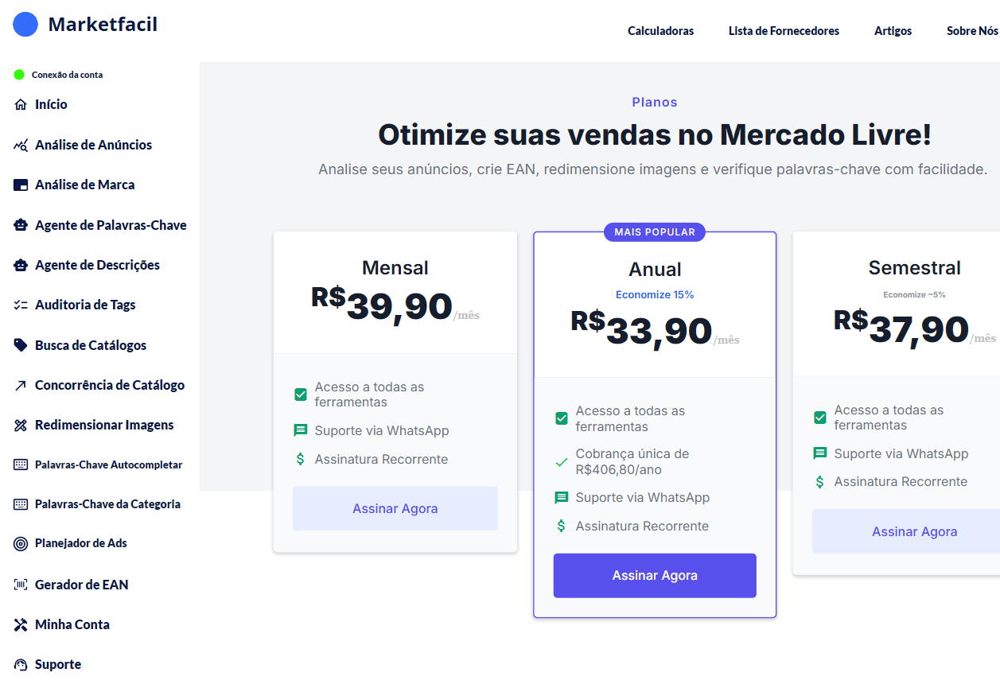

# Planos e pagamento

O Marketfacil tem três planos — todos dão **acesso completo a todas as ferramentas** e **suporte via WhatsApp**. A diferença está no prazo de cobrança.

Acesse em [app.marketfacil.com.br/pagamento](https://app.marketfacil.com.br/pagamento).

## Planos disponíveis

| Plano | Preço por mês | Observações |
|-------|--------------|-------------|
| **Mensal** | R$ 39,90 | Assinatura recorrente |
| **Anual** ⭐ | R$ 33,90 | Cobrança única de R$ 406,80/ano · Economize 15% · **Mais popular** |
| **Semestral** | R$ 37,90 | Economize ~5% |

### O que vem em todos os planos

- ✅ Acesso a todas as ferramentas
- ✅ Suporte via WhatsApp
- ✅ Assinatura recorrente (pode cancelar)

## Limites de uso

**Atualmente não há limites de uso** no Marketfacil — você pode rodar as ferramentas quantas vezes precisar dentro do seu plano.

## Reembolso

Política de reembolso padrão: **7 dias** a partir da contratação. Se não se adaptar, entre em contato pelo [suporte](../faq-e-suporte.md) dentro desse prazo.

## Cancelamento

Para cancelar, entre em contato pelo [suporte](../faq-e-suporte.md) — cancelamentos são processados pelo time.

## Perguntas frequentes

**P: Posso mudar de plano?**
R: Sim — upgrade e downgrade são permitidos. Fale com o suporte.

**P: A cobrança é recorrente?**
R: Sim. Nos planos Mensal e Semestral a cobrança recorre automaticamente. No Anual é uma cobrança única anual.

**P: Todas as features estão em todos os planos?**
R: Sim. O plano não restringe features — só o prazo de cobrança muda.
