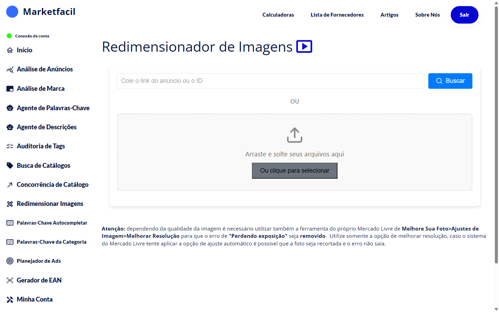

# Redimensionar Imagens

O Mercado Livre atualizou o padrão de imagens para **1200x1540**. Imagens nesse tamanho ficam **maiores** nas buscas de celular e nos catálogos — o que se traduz em mais cliques. Fotos fora desse tamanho podem receber a penalidade **"Perdendo exposição"**.

O **Redimensionador** resolve isso: você informa um anúncio (ou sobe as fotos direto), e o app entrega as imagens no padrão novo, prontas pra substituir no Mercado Livre.

## Como usar

### Opção 1 — direto pelo anúncio
1. No menu lateral, clique em **Redimensionar Imagens**.
2. Cole o link ou ID do anúncio.
3. Clique em **Buscar**.
4. O app baixa, redimensiona e te entrega as imagens.

### Opção 2 — upload manual
1. Arraste as imagens para a área demarcada **OU** clique em **Ou clique para selecionar**.
2. O app redimensiona.
3. Baixe as imagens prontas.

## Dicas

- Use **fotos originais em alta resolução** — redimensionar pra cima reduz qualidade.
- Se a tag "Perdendo exposição" persistir depois do redimensionamento, use também a ferramenta do ML em **Melhore Sua Foto → Ajustes de Imagem → Melhorar Resolução**.
- Evite o "Ajuste automático" do ML quando for aplicar a imagem nova — pode recortar de forma indesejada.

## Atenção


⚠️ Dependendo da qualidade da imagem original, o redimensionamento pode não eliminar totalmente a tag **"Perdendo exposição"**. Nesse caso, use também o **Melhorar Resolução** do próprio Mercado Livre. Evite o **Ajuste Automático** — ele pode recortar a foto e manter o erro.


## Perguntas frequentes

**P: Quantas imagens posso redimensionar por vez?**
R: Não há limite prático — o app processa todas.

**P: A qualidade diminui?**
R: Não. O app redimensiona inteligentemente. Só perde qualidade se a foto original for menor que o tamanho alvo.

**P: Funciona com fotos de catálogo?**
R: Sim, funciona com fotos de anúncios (MLB), produtos (MLBU) e catálogos.
